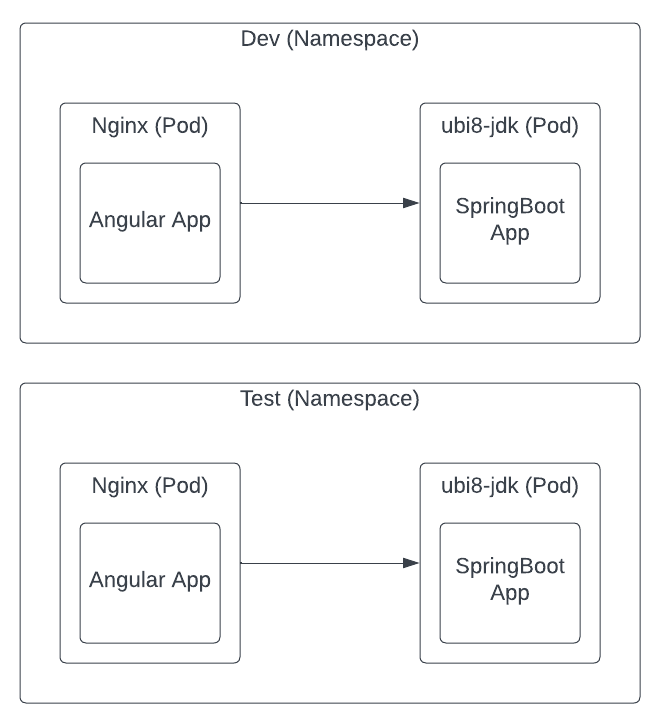

## Angular
  - Code updates
  - Proxy configuration for dev environments
  - Build from Dockerfile (Node + Nginx)
## Nginx
  - Reverse proxy configuration
## Deployment Updates
  - External config using ConfigMap
